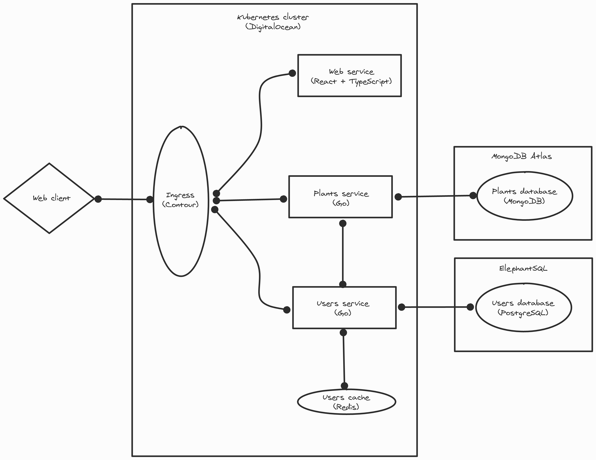

# Plantdex

Plantdex is an application to catalog plants. It allows users to store information about a plant with structured profiles to use as a catalog or knowledge storage.

## Background

This is my main side project. I started it as a way to learn and also to solve a need I have, as I want to save the knowledge about agriculture my family has.

It is currently a work in progress live at [plantdex.app](https://plantdex.app), but not open to the public.

## Technologies

The stack is:

- [Go](https://golang.org/)
- [TypeScript](https://www.typescriptlang.org/)
- [React](https://reactjs.org/)
- [GSS](https://github.com/lewislbr/gss)
- [MongoDB](https://www.mongodb.com/)
- [PostgreSQL](https://www.postgresql.org/)
- [Redis](https://redis.io/)
- [Kubernetes](https://kubernetes.io/)
- [Contour](https://projectcontour.io/)

It is deployed with [GitHub Actions](https://github.com/features/actions) to [DigitalOcean](https://www.digitalocean.com/), and uses cloud databases from [MongoDB Atlas](https://www.mongodb.com/cloud/atlas) and [ElephantSQL](https://www.elephantsql.com/).

All services are containerized with [Docker](https://www.docker.com/).

For development, a setup with [Envoy](https://www.envoyproxy.io/) and [Docker Compose](https://docs.docker.com/compose/) is used to mimic the production system. Additionally, all commits are subject to a [pre-commit](https://pre-commit.com/) git hook to run formatting, linting, and testing.

## Architecture

The overview of the system is as follows:

The components in more detail are:

### Web service

Represents the UI of the application, serving static assets available via browser and PWA capable.

It is a React application written in TypeScript and served with GSS.

### Plants service

Enables CRUD operations of all plant-related data.

It is a Go application connected to a cloud MongoDB database stored in MongoDB Atlas, and it gets authorization for all its requests from the users service. It follows the [Clean Architecture](https://blog.cleancoder.com/uncle-bob/2012/08/13/the-clean-architecture.html) and uses the standard library as much as possible.

### Users service

Enables the creation, authentication, and information of users, as well as the generation, validation, and revokation of [PASETO](https://paseto.io/) tokens.

It is a Go application connected to a cloud PostgreSQL database stored in ElephantSQL, and it uses Redis as a cache to store revoked tokens. It follows the [Clean Architecture](https://blog.cleancoder.com/uncle-bob/2012/08/13/the-clean-architecture.html) and uses the standard library as much as possible.

### Ingress

Handles the access and routing of external traffic to the services in the Kubernetes cluster, managing the headers, rate limits, and retry policies of the services.

It is a Contour ingress controller.
